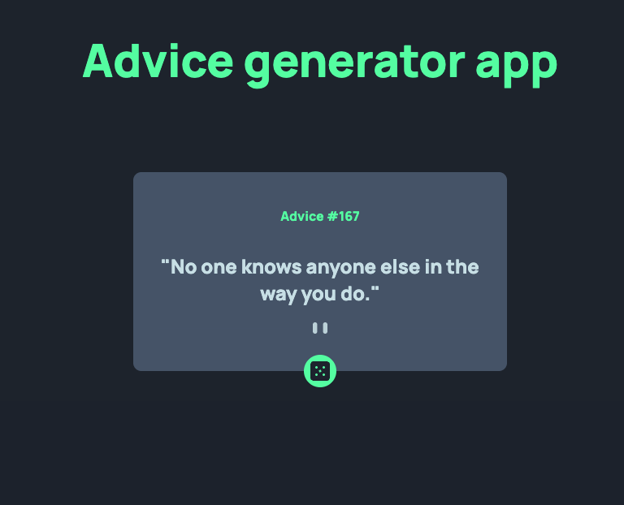

## Table of contents

- [Overview](#overview)
  - [The challenge](#the-challenge)
  - [Screenshot](#screenshot)
  - [Links](#links)
- [My process](#my-process)
  - [Built with](#built-with)
  - [What I learned](#what-i-learned)
  - [Continued development](#continued-development)
  - [Useful resources](#useful-resources)
- [Author](#author)
- [Acknowledgments](#acknowledgments)

## Overview

### The challenge

Users should be able to:

- View the optimal layout for the app depending on their device's screen size  
- See hover states for all interactive elements on the page  
- Generate a new piece of advice by clicking the dice icon  

### Screenshot



### Links

- **Solution URL:** [https://github.com/youssefkouliana/advice-generator-app](https://github.com/youssefkouliana/advice-generator-app)
- **Live App URL:** https://youssefkouliana.github.io/advice-generator-app/
## My process

### Built with

- Semantic **HTML5** markup  
- **CSS3** (flexbox, custom properties, responsive design)  
- **Vanilla JavaScript (ES6+)** using `fetch()` and `async/await`  
- **Mobile-Responsive** workflow  

### What I learned

This project taught me how to use the `fetch()` API to retrieve data from an external source and display it dynamically on the page.  
I also learned how to prevent cached responses by adding a timestamp to each request.

Here’s a small piece of code I’m proud of:

```js
async function getAdvice() {
  try {
    const response = await fetch(`https://api.adviceslip.com/advice?t=${Date.now()}`, { cache: 'no-cache' });
    const data = await response.json();
    const { id, advice } = data.slip;
    adviceId.textContent = `Advice #${id}`;
    adviceText.textContent = `"${advice}"`;
  } catch (error) {
    adviceText.textContent = "Couldn’t fetch advice. Please try again.";
  }
}


Continued development

In upcoming projects, I want to:
Add a loading spinner or dice animation while new advice is fetched
Store a history of previous advice in local storage
Rebuild this challenge using React to practice component-based design
Useful resources

Advice Slip API
 – The public API used for generating random advice

MDN Web Docs: Fetch API
 – Helped me understand async/await and error handling

Frontend Mentor Community
 – For feedback and tips from other developers

Author

Website: ykdesignstudio.se

GitHub: @youssefkouliana
